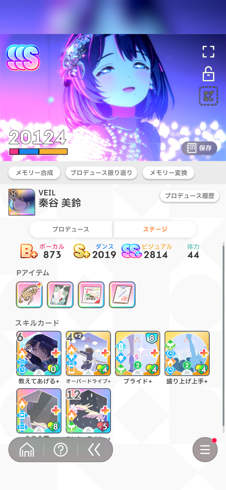
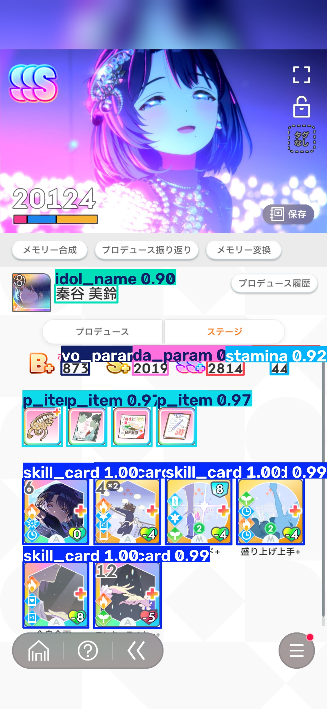
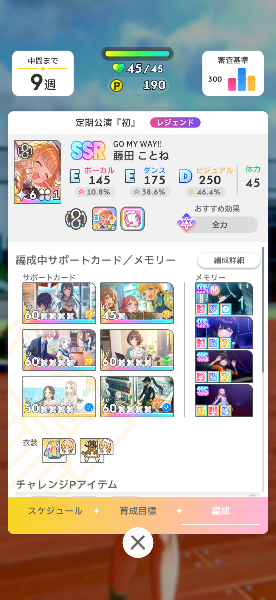
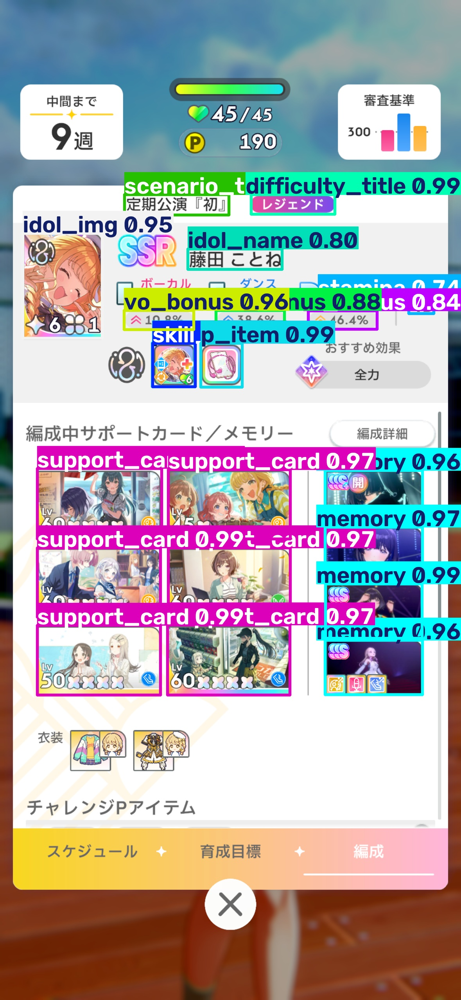
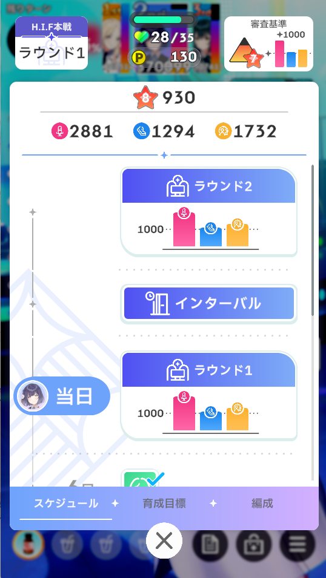
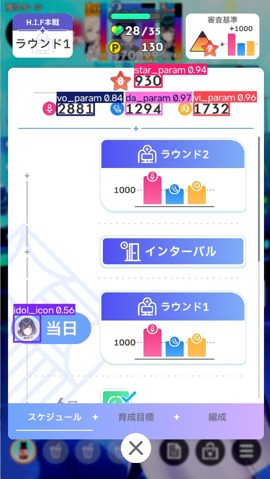

# Gakumasu UI Detector

「学園アイドルマスター」のゲーム画面に含まれるUI要素を検出するための
YOLOベース物体検出モデルの学習・評価コードです。

本リポジトリでは、Ultralytics YOLO11n をベースモデルとして使用し、
ゲーム画面内の各種UI要素を23クラスに分類して検出するモデルを学習しています。

学習済みモデルは、別リポジトリで公開している Discord Bot の画像解析処理で使用しています。

## モデル情報

| 項目 | 内容 |
| --- | --- |
| Base Model | YOLO11n |
| Input Size | 640 × 640 |
| Classes | 23 |
| Dataset Images | 1,100 |
| Train / Validation | 880 / 220 |
| Epochs | 30 |
| Parameters | 約 2.59M |
| mAP50 | 約 0.995 |
| mAP50-95 | 約 0.90 |
| Export Format | ONNX |
| ONNX Model Size | 約 10.1 MB |

## 検出例

学習済みモデルによるUI検出例です。

### Example 1
| Input | Output |
| --- | --- |
|  |  |

### Example 2
| Input | Output |
| --- | --- |
|  |  |

### Example 3
| Input | Output |
| --- | --- |
|  |  |

> 検出例には「学園アイドルマスター」のゲーム画面を使用しています。
> ゲーム内の画像・名称等の権利は各権利者に帰属します。

## 検出クラス

本モデルでは、ゲーム画面内の以下23種類のUI要素を検出します。

- `skill_card`
- `p_item`
- `idol_img`
- `idol_name`
- `vo_param`
- `da_param`
- `vi_param`
- `vo_bonus`
- `da_bonus`
- `vi_bonus`
- `stamina`
- `support_card`
- `memory`
- `scenario_title`
- `difficulty_title`
- `idol_icon`
- `fan_count`
- `star_param`
- `exam_score`
- `vo_score`
- `da_score`
- `vi_score`
- `kirameki`

クラス定義の詳細は `dataset/data.yaml` および `dataset/classes.txt` を参照してください。

## データセット

学習には、アノテーション済み画像 1,100 枚を使用しています。

データセットは以下の割合で学習用・検証用に分割しています。

- Train: 880 images
- Validation: 220 images
- Split ratio: 80 / 20

データセットの分割には `scripts/split_dataset.py` を使用しています。

```bash
python scripts/split_dataset.py
```

デフォルトでは以下の構成を想定しています。

```text
dataset/
├── images/
│   ├── all/
│   ├── train/
│   └── val/
└── labels/
    ├── all/
    ├── train/
    └── val/
```

画像データおよびアノテーションデータ本体は、本リポジトリには含まれていません。

## 学習設定

学習には Ultralytics YOLO11n を使用しています。

主な学習条件は以下の通りです。

```text
Model: yolo11n.pt
Image Size: 640
Epochs: 30
Batch Size: 16
Seed: 0
Deterministic: True
```

学習コードの詳細は以下のNotebookを参照してください。

```text
notebooks/YOLO.ipynb
```

## Data Augmentation

ゲーム画面の表示環境や画像圧縮、色変化などに対する頑健性を高めるため、
Ultralytics標準のData Augmentationに加えて、
Albumentationsを使用したAugmentationを適用しています。

主に以下の処理を使用しています。

* Motion Blur
* Gaussian Blur
* Random Brightness / Contrast
* JPEG Compression
* Gaussian Noise
* RGB Shift

また、UIの位置関係を大きく崩さないよう、
Mosaic、MixUp、CutMix、左右反転など一部の標準Augmentationは無効化しています。

詳細なパラメータは `notebooks/YOLO.ipynb` に記載しています。

## 評価

学習後のモデルについて、Validation Datasetを用いて評価を行っています。

全体の評価では以下の性能を確認しています。

```text
mAP50     : 約 0.995
mAP50-95  : 約 0.90
```

また、Notebook内では各クラスごとに以下の指標を確認できます。

* Precision
* Recall
* F1 Score
* mAP50
* mAP50-95
* Validation Instances

## 学習済みモデル

学習済みモデルは GitHub Releases から取得できます。

https://github.com/shunya200426/gakumasu-ui-detector/releases

| File | Format | 用途 |
| --- | --- | --- |
| `best.pt` | PyTorch | 評価・再学習・Export |
| `best.onnx` | ONNX | ONNX Runtime等による推論 |

Discord Botでは、`best.onnx` を `ui_detector.onnx` として使用しています。

## モデルのExport

学習済みPyTorchモデルは、Botでの推論に使用するためONNX形式へExportできます。

```python
best_model.export(
    format="onnx",
    imgsz=640,
    dynamic=False,
    simplify=True,
    opset=12,
)
```

現在Botで使用しているONNXモデルは約10.1 MBです。

NotebookにはTensorRT EngineへのExport処理も含まれています。

TensorRT Exportを使用する場合は、別途CUDAおよびTensorRTが利用可能な環境が必要です。

## 環境構築

Python仮想環境を作成し、依存パッケージをインストールします。

```bash
python -m venv venv
source venv/bin/activate

pip install -r requirements.txt
```

主な依存パッケージは以下です。

* Ultralytics
* Albumentations
* OpenCV
* NumPy
* pandas
* matplotlib
* ONNX
* ONNX Slim

## リポジトリ構成

```text
.
├── dataset/
│   ├── classes.txt
│   └── data.yaml
├── notebooks/
│   └── YOLO.ipynb
├── scripts/
│   └── split_dataset.py
├── requirements.txt
├── .gitignore
└── LICENSE
```

学習用画像、ラベル、学習結果、仮想環境、モデルウェイトなどは
`.gitignore` によりGit管理対象から除外しています。

## 関連プロジェクト

本モデルは、学園アイドルマスターのスコア計算を支援するDiscord Botで使用しています。

Bot本体:

[https://github.com/shunya200426/gakumasu-discord-bot](https://github.com/shunya200426/gakumasu-discord-bot)

Botでは、ONNX Runtimeを使用してUI検出を行い、
検出された領域に対してOCR処理を行っています。

## ライセンス

本リポジトリは GNU Affero General Public License v3.0 (AGPL-3.0) のもとで公開しています。

詳細は `LICENSE` を参照してください。

本プロジェクトでは Ultralytics YOLO を使用しています。